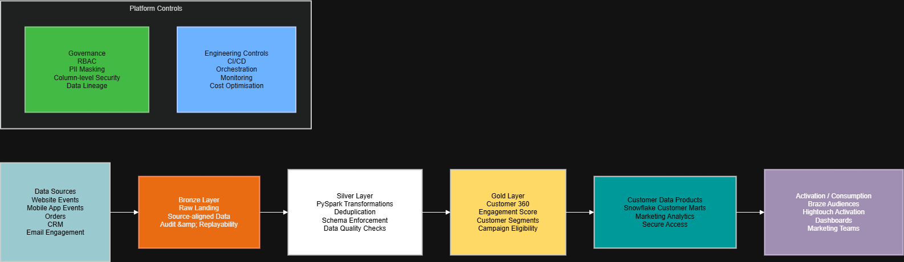

# Customer Engagement Analytics Platform

## Overview

This project demonstrates a modern customer engagement analytics platform built using PySpark and medallion architecture principles.

The goal of the platform is to ingest and process customer behavioural data from multiple sources, transform it into analytics-ready datasets, and support downstream customer segmentation and marketing activation use cases.

The implementation is designed to reflect common patterns used in modern cloud data platforms leveraging technologies such as Databricks, Delta Lake and Snowflake.

---

## Business Problem

Many organisations struggle to unify customer interaction data across multiple systems including:

* website activity
* mobile application events
* CRM platforms
* transaction systems
* marketing engagement tools

This often results in:

* fragmented customer views
* inconsistent reporting
* poor segmentation quality
* delayed campaign activation
* duplicated business logic across teams

The objective of this platform is to centralise customer event data and create trusted, analytics-ready datasets for reporting, customer intelligence and marketing activation.

---

## Architecture Diagram

---

## Architecture Approach

The platform follows a medallion architecture approach.

### Bronze Layer

Raw ingestion layer containing source-aligned data with minimal transformation.

Responsibilities:

* ingest raw JSON event data
* preserve source fidelity
* support replayability and auditing

### Silver Layer

Cleansed and standardised transformation layer.

Responsibilities:

* schema enforcement
* timestamp normalisation
* deduplication
* null handling
* business rule validation

### Gold Layer

Business-facing curated datasets.

Responsibilities:

* customer analytics
* segmentation datasets
* KPI generation
* campaign-ready outputs

## Why a Medallion Architecture?

- Bronze preserves source fidelity.
- Silver standardises and validates data.
- Gold produces business-facing customer data products.
- Separation of concerns improves maintainability and scalability.

---

## Technologies Used

| Technology             | Purpose                           |
| ---------------------- | --------------------------------- |
| PySpark                | Distributed data processing       |
| Delta Lake Concepts    | ACID-compliant lakehouse patterns |
| SQL                    | Analytical transformations        |
| Snowflake              | Analytics serving layer           |
| Python                 | Data engineering workflows        |
| Medallion Architecture | Layered data modelling approach   |

---

## Key Features

### Incremental Processing

The pipeline is designed with incremental ingestion patterns to support scalable processing of new customer event data.

### Deduplication Logic

Duplicate event handling is implemented to ensure idempotent processing where upstream systems resend records.

### Data Quality Validation

Basic validation rules are applied before data promotion into curated layers, including:

* null checks
* timestamp validation
* invalid transaction filtering

### Customer Analytics

The gold layer produces curated datasets including:

* customer lifetime value
* purchase frequency
* recent activity metrics
* engagement indicators
* campaign eligibility datasets

---

## Example Use Cases

### Customer Segmentation

Identify highly engaged customers for targeted marketing campaigns.

### Campaign Activation

Provide activation-ready datasets for customer engagement platforms such as Braze or Hightouch.

### Executive Reporting

Support business reporting with trusted and standardised customer metrics.

### Operational Analytics

Enable near real-time visibility into customer activity trends.

---

## Production Considerations

In a production implementation, additional capabilities would typically include:

* orchestration via Airflow or Databricks Workflows
* CI/CD pipelines using Azure DevOps or GitHub Actions
* infrastructure provisioning using Terraform
* RBAC and column-level security
* observability and monitoring
* schema evolution handling
* partition optimisation
* structured streaming ingestion
* automated data quality frameworks

---

## Snowflake Considerations

The curated gold datasets are intended to be surfaced through Snowflake serving marts optimised for:

* BI workloads
* marketing segmentation
* customer analytics
* campaign activation

Key considerations include:

* warehouse sizing strategies
* clustering optimisation
* role-based access control
* cost management
* secure data sharing

---

## Roadmap

### Phase 1 – Core Customer Data Platform (Current)
- Multi-source customer event ingestion
- Bronze, Silver and Gold data layers
- Customer 360 data model
- Customer segmentation
- Campaign eligibility modelling
- Customer data products for analytics and activation

### Phase 2 – Production Readiness
- Automated data quality monitoring
- Data contract validation
- SLA tracking and alerting
- Enhanced observability and pipeline monitoring
- Infrastructure as Code (Terraform)
- Automated testing framework

### Phase 3 – Customer Intelligence
- Customer consent and preference management
- Propensity scoring models
- Churn prediction
- Customer lifetime value modelling
- Dynamic audience generation
- Next-best-action recommendations

### Phase 4 – Real-Time Activation
- Event-driven ingestion architecture
- Real-time customer segmentation
- Real-time journey triggering
- Streaming analytics
- Personalisation at scale
- Advanced experimentation and A/B testing
---

## Notes

This project is intended as a lightweight demonstration of modern data engineering and customer analytics architecture patterns.

The implementation focuses on demonstrating scalable design principles, transformation logic and production-oriented thinking rather than full infrastructure deployment.
